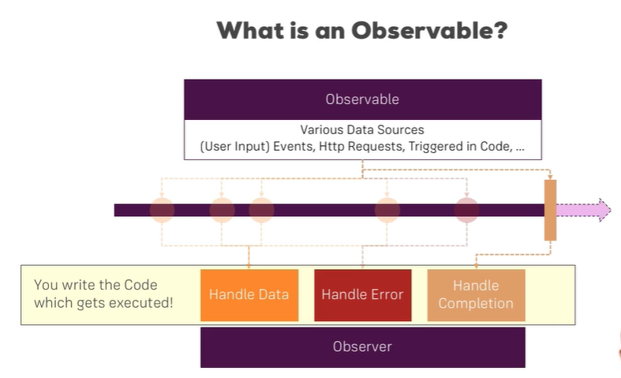
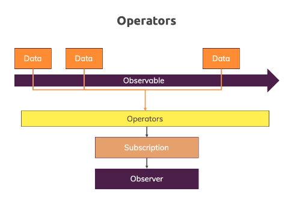
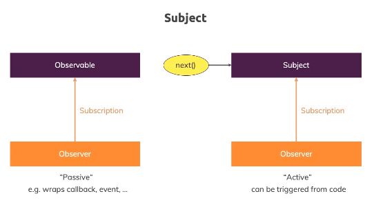

## Understanding Observables

Observable = a datasource, an object to import from rxjs (a 3rd party)

We have an "observable" and an "observer"

On a stream / timeline we can have multiple events implemented by an observable...depending on the data source (because you trigger it, automatically, via a button clicked, as http service does it through a request return)

## Analyzing Angular Observables

In order to follow along smoothly with the course examples, make sure you install RxJS v6 by running

npm install --save rxjs@6

In addition, also install the rxjs-compat package:

npm install --save rxjs-compat

Params = observable, you "subscribe" to, to be aware in changes of data

## Getting closer to the core of observables

## building a custom observable

## errors & completion

## observables and you

## Understanding Operators

